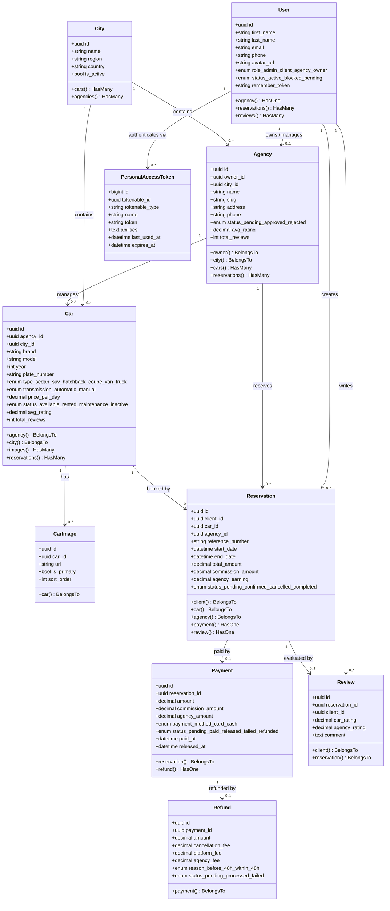
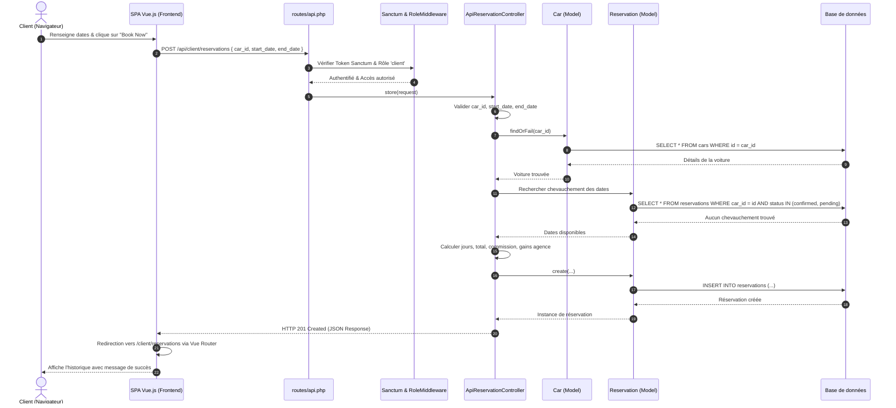
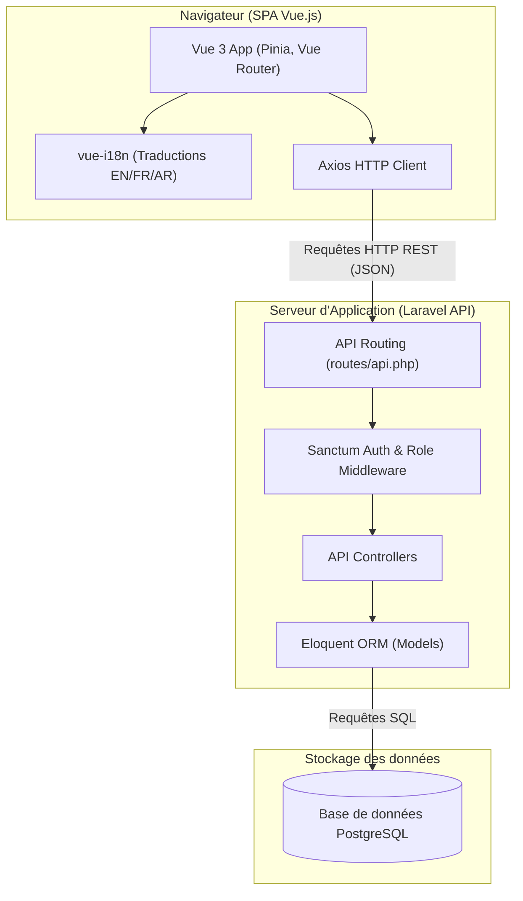
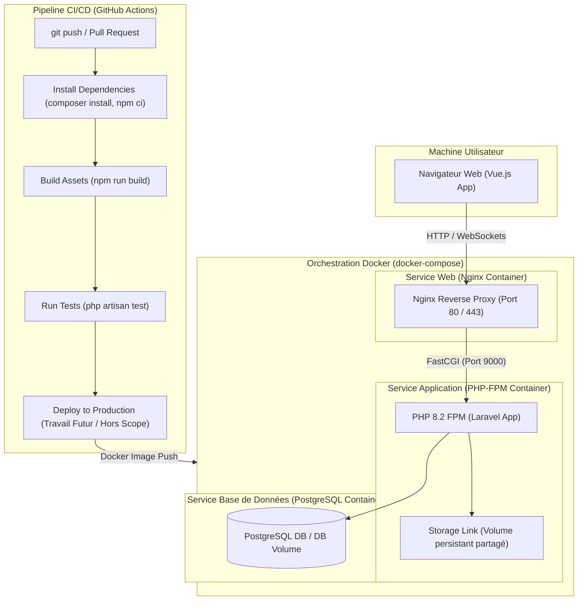

# Rapport de Projet & Architecture
## Global Rental Car Management

Ce document détaille l'architecture logicielle, les décisions techniques clés, le Design System, et l'infrastructure DevOps du projet, suivis de l'analyse UML complète du système.

---

## 1. Architecture Globale & Décisions Techniques Clés

L'architecture du projet s'articule autour d'un backend robuste en **Laravel** exposant une API REST sécurisée, et d'un frontend moderne en **Vue.js**. 

### Pourquoi deux frontends coexistent-ils ?
Dans le code source, vous remarquerez la présence simultanée de vues **Inertia.js** (dans `backend/resources/js`) et d'une application **SPA Vue.js découplée** (dans le dossier `frontend/`). Il s'agit d'une réponse directe à l'évolution des consignes du projet :
1. **Phase 1 (Le MVP avec Inertia) :** Le cahier des charges initial exigeait explicitement "l'intégration de Vue.js dans les vues, sans API REST". Pour satisfaire cette contrainte, l'application a été développée comme un monolithe utilisant Laravel Breeze et Inertia.js.
2. **Phase 2 (La SPA Découplée) :** Par la suite, une nouvelle instruction du professeur a requis la séparation stricte du frontend et du backend via une API. C'est pourquoi la nouvelle SPA Vue.js a été ajoutée. Les deux implémentations sont conservées : l'application Inertia comme référence de conformité au cahier des charges original, et la SPA comme livrable répondant à la nouvelle exigence d'architecture découplée.

---

## 2. Design System & Internationalisation (i18n)

Le développement du nouveau frontend SPA a été accompagné de la mise en place d'un Design System performant et inclusif issu de plusieurs itérations :
*   **Esthétique & Thèmes :** L'application n'utilise pas de frameworks CSS lourds (comme Tailwind ou Bootstrap). Un système de variables CSS natives a été conçu. Au lieu d'un simple bascule clair/sombre, il offre trois identités visuelles (thèmes) distinctes : `calm` (thème clair, ivoire/sarcelle), `majestic` (hybride clair avec en-têtes sombres, émeraude/or), et `marque` (thème sombre premium, inspiré de marques automobiles comme Bentley/Ferrari).
*   **Multilinguisme (i18n) :** Le système intègre `vue-i18n` pour supporter trois langues : **Anglais, Français et Arabe**. Les traductions incluent des données dynamiques (villes, couleurs) et des clés statiques d'interface.
*   **Devises & Support RTL (Right-to-Left) :** Pour l'intégration de l'Arabe, l'interface bascule dynamiquement l'attribut `dir="rtl"`. L'intégration a nécessité l'isolation bidirectionnelle des prix (`unicode-bidi: isolate` via la classe `.price-value`) pour garantir que les montants avec suffixe (ex: "450 MAD") conservent leur ordre naturel. Les polices basculent sur *Markazi Text* (adaptée à la calligraphie arabe).

---

## 3. Infrastructure & DevOps Setup

Le projet utilise une infrastructure **Dockerisée** garantissant une stricte parité entre le développement et la production.
*   **Conteneurs Multiples :** L'application est orchestrée via `docker-compose` avec trois services principaux : `db` (PostgreSQL 15), `app` (PHP-FPM 8.2 contenant Laravel) et `web` (Serveur Nginx).
*   **Processus de Build Multi-Stage :** Le frontend SPA Vue.js est compilé par **Vite** dans un conteneur Node.js éphémère. Les fichiers statiques générés (`dist/`) sont ensuite injectés directement dans le conteneur `web` Nginx. Cela permet de servir l'application frontale à une vitesse maximale, tout en agissant comme un Reverse Proxy (Proxy inverse) redirigeant les appels `/api` vers le conteneur PHP-FPM, ce qui minimise les problèmes CORS en production même si une configuration CORS explicite (`config/cors.php`) reste présente pour le développement local.

---

## 4. Analyse UML

### 4.1 Diagramme de Cas d'Utilisation

Le système expose une API REST sécurisée par Laravel Sanctum et filtrée par rôles. Les interactions sont structurées autour de quatre profils d'utilisateurs distincts.

```mermaid
flowchart TD
    %% Déclaration des acteurs
    subgraph Acteurs ["Acteurs du Système"]
        Visiteur(["Visiteur Public"])
        Client(["Client Authentifié"])
        Proprio(["Propriétaire d'Agence"])
        Admin(["Administrateur"])
    end

    %% Déclaration des Cas d'Utilisation
    subgraph Public ["Espace Public"]
        UC_Cities(Consulter les villes)
        UC_Agencies(Consulter les agences approuvées)
        UC_Cars(Rechercher des voitures disponibles)
        UC_Reviews(Consulter les avis)
        UC_Auth(S'inscrire / Se connecter)
    end

    subgraph ClientSpace ["Espace Client"]
        UC_Book(Créer une réservation)
        UC_MyBookings(Consulter ses réservations)
        UC_Cancel(Annuler une réservation)
        UC_Pay(Payer sa réservation)
        UC_Refund(Demander un remboursement)
        UC_WriteReview(Publier un avis)
    end

    subgraph AgencySpace ["Espace Propriétaire d'Agence"]
        UC_Profile(Modifier le profil de l'agence)
        UC_ManageCars(Gérer le parc automobile CRUD)
        UC_CarImages(Gérer les images de voitures)
        UC_AgencyBookings(Consulter les réservations de l'agence)
        UC_AgencyPayments(Suivre les revenus et paiements)
    end

    subgraph AdminSpace ["Espace Administrateur"]
        UC_Dashboard(Tableau de bord et métriques globales)
        UC_ManageUsers(Gérer les utilisateurs)
        UC_ApproveAgencies(Approuver / rejeter les agences)
        UC_AdminCities(Gérer les villes et hubs)
        UC_Escrow(Gérer les paiements et libérer les garanties)
        UC_ModerateReviews(Supprimer / restaurer les avis)
    end

    %% Connexions Acteurs -> Cas d'utilisation
    Visiteur --> UC_Cities
    Visiteur --> UC_Agencies
    Visiteur --> UC_Cars
    Visiteur --> UC_Reviews
    Visiteur --> UC_Auth

    Client --> UC_Book
    Client --> UC_MyBookings
    Client --> UC_Cancel
    Client --> UC_Pay
    Client --> UC_Refund
    Client --> UC_WriteReview

    Proprio --> UC_Profile
    Proprio --> UC_ManageCars
    Proprio --> UC_CarImages
    Proprio --> UC_AgencyBookings
    Proprio --> UC_AgencyPayments

    Admin --> UC_Dashboard
    Admin --> UC_ManageUsers
    Admin --> UC_ApproveAgencies
    Admin --> UC_AdminCities
    Admin --> UC_Escrow
    Admin --> UC_ModerateReviews
```

---

### 4.2 Diagramme de Classes

Le diagramme ci-dessous représente la structure des données du backend Laravel (modèles Eloquent, attributs de base de données et relations d'association).

---

### 4.3 Diagramme de Séquence (Création de Réservation via API REST)

Ce diagramme illustre le scénario réel de soumission du formulaire de réservation par un client depuis la nouvelle SPA Vue.js vers l'API Laravel.

*Note : Le flux équivalent pour l'application Inertia.js (Phase 1) utilise l'authentification par session/cookie via le RoleMiddleware et retourne une réponse `Inertia::render()` au lieu de JSON. Bien que les mécanismes de réponse (HTTP 303 Redirect vs HTTP 201 JSON) et de gestion des erreurs diffèrent, la logique métier interne — validation, verrouillage, calcul du prix — reste identique.*

---

### 4.4 Diagramme de Composants

Ce diagramme illustre la structure des modules applicatifs de la nouvelle architecture découplée, où la SPA Vue.js communique avec le backend via l'API REST Laravel.

*Note : Parallèlement à ce flux SPA, l'architecture supporte toujours le flux monolithique où le middleware Inertia.js remplace l'API pour s'interfacer avec le Frontend interne.*

---

### 4.5 Diagramme de Déploiement

Ce diagramme décrit l'architecture physique de production orchestrée avec Docker et le pipeline CI/CD GitHub Actions.

---

## 5. Limites Connues & Travaux Futurs

Tout projet ayant un périmètre délimité (Scope), voici les compromis assumés et les éléments identifiés pour un développement ultérieur :
*   **Périmètre de Traduction :** Les données dynamiques ou spécifiques (noms des marques/modèles, noms des agences, commentaires des utilisateurs) ne sont volontairement pas traduites car elles relèvent du contenu généré par l'utilisateur et non de l'interface logicielle.
*   **Fonctionnalités Cartographiques :** La sélection du lieu de prise en charge sur une carte statique et la simulation du suivi du véhicule ont été délibérément différées (hors périmètre du MVP actuel) en attente d'une coordination de groupe.
*   **Déploiement Cloud / CI/CD :** Le jalon actuel se limite à une démonstration locale conteneurisée via Docker. L'étape de déploiement cloud automatisé figurant de manière aspiratoire dans l'UML reste un travail futur non implémenté.
*   **Passerelle de Paiement Simulée :** L'endpoint de paiement (`pay()`) se contente actuellement de basculer un statut en base de données de manière asynchrone. L'intégration d'une véritable passerelle (ex: Stripe, PayPal) est requise pour une mise en production.
*   **Sécurité des Transactions :** Bien qu'un correctif technique critique (bonus) ait été apporté pour résoudre une faille de concurrence (Race Condition) dans `PaymentController::release`, l'ensemble du flux financier nécessiterait un audit de sécurité approfondi.

